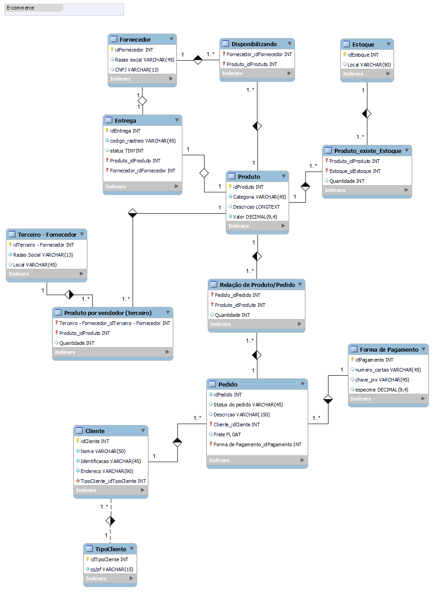

# Refinando um Projeto Conceitual de Banco de Dados - E-COMMERCE

O primeiro projeto construído a parti do desafio proposto no Bootcamp Banco de Dados Experience da [DIO](https://www.dio.me/).

##  Objetivo

Refine o modelo apresentado acrescentando os seguintes pontos:

- Cliente PJ e PF – Uma conta pode ser PJ ou PF, mas não pode ter as duas informações;
- Pagamento – Pode ter cadastrado mais de uma forma de pagamento;
- Entrega – Possui status e código de rastreio;

##  ⚒️ Tecnologias

- Banco de Dados
- Git e Github